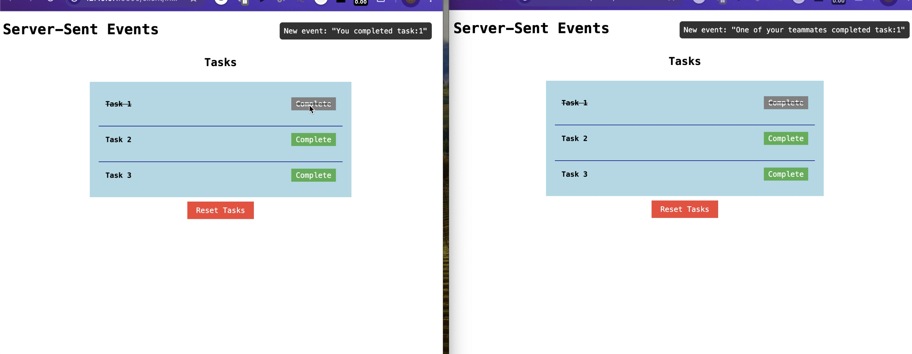

# Server-Sent Events

This project demonstrates how to set up a server and run both the server and client for Server-Sent Events.

## Setup

1. Clone this repository: `git clone https://github.com/Harish-clb/server-sent-events.git`
2. Navigate to the project directory: `cd server-sent-events`

## Server Setup

3. Install dependencies:
```
npm install
```

4. Running the Server
To start the server, run the following command:

```
npm start
```

The server will start running on `http://localhost:5000`.

## Running the Client

Navigate to client directory and run the __index.html__ file.

## Image
Screenshot of 2 clients where event message is different based on client who takes action


